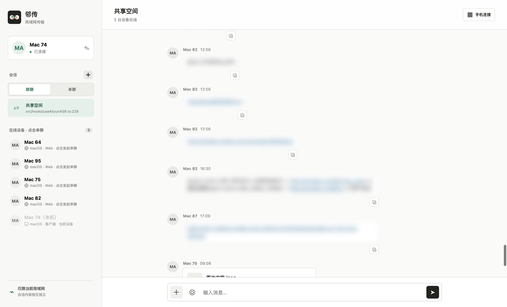
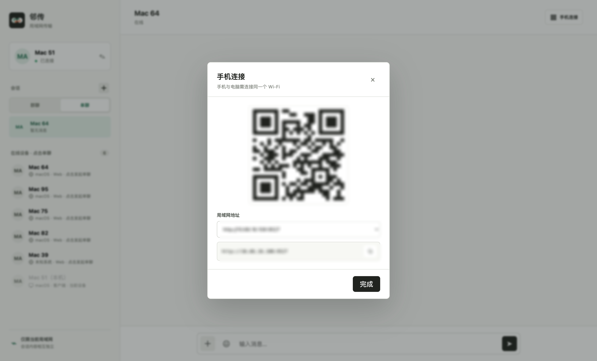
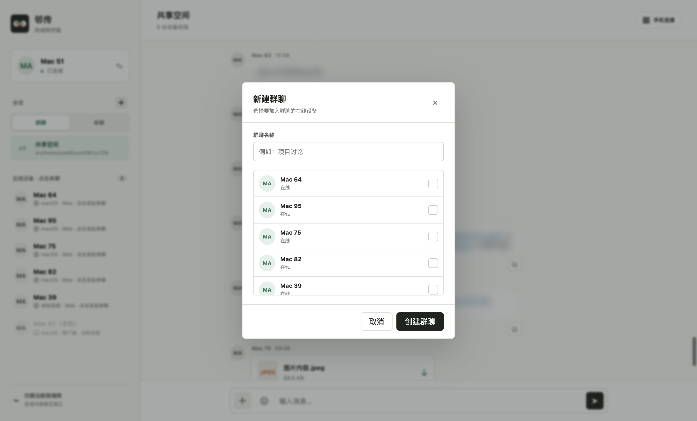
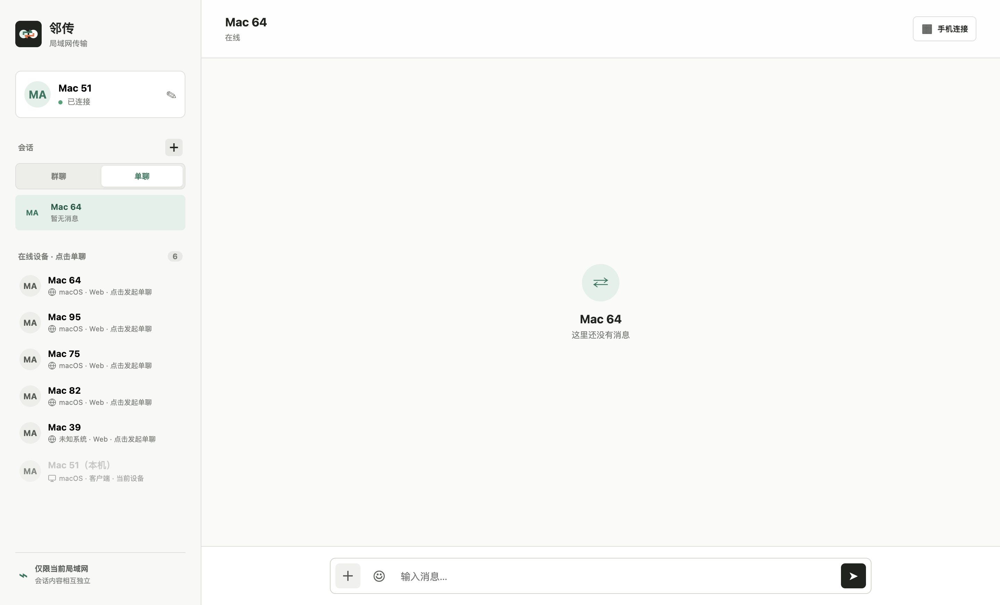

# Linktran

中文文档：[README.md](README.md)

Release history: [CHANGELOG.md](CHANGELOG.md)

Linktran is a local-network messaging and file-transfer tool for offices, homes, and temporary collaboration. Devices on the same Wi-Fi or LAN can connect through a browser without accounts or public cloud services.

> Linktran uses one LAN service node and multiple clients. It is not peer-to-peer: all devices must connect to the same Linktran service address.

## Features

- Shared space, independent one-to-one chats, and group chats
- Real-time online-device discovery and message delivery
- Device platform and client-type detection (desktop, web, mobile, extension)
- Custom device nickname and avatar (PNG, JPG, or WebP)
- Chinese/English interface with automatic browser-language detection
- System, light, and dark appearance themes
- Group avatars composed from member avatars
- Unread counts, page-title reminders, and system notifications
- Native desktop notifications with Dock/taskbar unread badges
- Emoji input and Markdown rendering with GFM tables, task lists, and code blocks
- Structured `@` mentions for online devices in group chats and the shared space
- Paste clipboard images or files into the composer, preview them, and send together
- Rich-text paste converted to Markdown
- One-click message copying
- Drag-and-drop and batch file uploads, up to 1 GB per file
- SQLite persistence for profiles, chats, messages, and files
- LAN QR code for quick mobile connection
- macOS and Windows tray support in the desktop client
- Daily GitHub Release checks in the desktop client, with manual check and opt-out controls

## Screenshots

### Main interface

### Mobile QR connection

### Create a group chat

### Start a one-to-one chat

## Device profile and notification settings

Click the current device card in the left sidebar to upload an avatar or change the device nickname; profile updates are synchronized to other online devices. Click the gear button at the bottom of the left sidebar to open **Settings**, switch between Chinese and English, select the system/light/dark theme, and enable or disable new-message notifications. Application preferences are stored on the current device and take effect immediately.

## Running modes

- **Web:** start the LAN service and open `http://<host-ip>:9527`.
- **Desktop:** macOS and Windows clients wrap the same web interface and keep the service available from the system tray.
- **Browser extension:** stores local extension data in IndexedDB; it is currently separate from the LAN chat database.

## License

Linktran is released under the [MIT License](LICENSE). Commercial use is allowed under the license terms.
